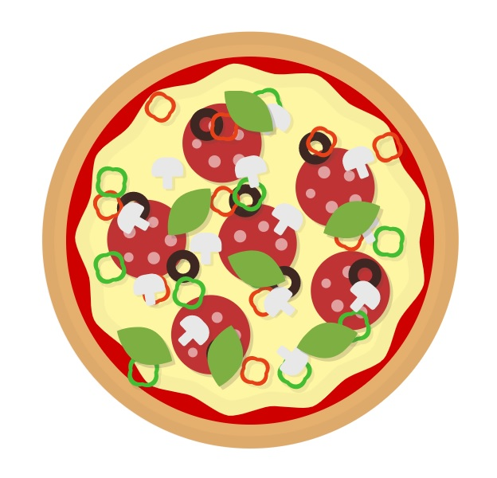

<p align="center">
<a href="https://mysterious-fjord-34712.herokuapp.com/"></a>
</p>


# <p align="center">🍕 Pizzeria project</p>
<p align="center">Project for learning object-oriented programming, AJAX and API</p>

</br>

## Table of Contents

- [What's this project about?](#about)
- [Technologies used](#technologies)
- [What I learned?](#what)
- [Interesting code snippet](#interesting)
- [Installation](#install)
- [Heroku](#heroku)

</br>

## <a name="about"></a>What's this project about?

This is a SPA (Single Page Application) for pizzerias. It is divided into several tabs (Home, Order, Booking). The "Home page" contains general information (several interesting CSS effects are used). The "Order" tab allows interactive selection of ingredients with SVG image display as well as adding them to the cart and modifying the quantity for the order. In the "Booking" tab we can see the layout of the restaurant, check the availability of tables and reserve a specific table.


</br>

## <a name="technologies"></a>Technologies used
- HTML
- CSS
- SCSS (with BEM approach)
- JavaScript
- npm
- GIT

</br>

## <a name="what"></a>What I learned?
- use more advanced object-oriented programming,
- knew the difference between functional and object-oriented programming,
- create file structures according to various conventions (including scss file splitting, components etc.),
- use <a href='https://handlebarsjs.com/'>Handlebars</a> (HTML template) in more advanced way,
- create exceptions for code quality checking plugins (<a href='https://eslint.org/docs/rules/no-inline-comments#top'>ESLint</a>),
- work in Kanban system and SCRUM agile methodology,
- use different types of events (change, click, submit etc.) and create completely new types,
- copy objects in different ways:
  - deep copy - JSON.parse(JSON.stringify(object),
  - shallow copy - Object.assign({}, object),
- use the outline in the VS code in the form of "table of contents",
- create and modify JSONs (JavaScript Object Notation),
- use Asynchronous JavaScript and XML,
- work with API,
- use tools to compare changes in files (<a href='http://meldmerge.org/'>Meld</a>, <a href='https://www.perforce.com/downloads/visual-merge-tool'>P4Merge</a>),
- use plugins to pick date (day and hours) (eg. <a href='https://flatpickr.js.org/'>flatpickr.js</a>, <a href='https://github.com/Stryzhevskyi/rangeSlider'>rangeSlider</a>),
- debug with the <a href='https://en.wikipedia.org/wiki/Rubber_duck_debugging'>rubber duck method</a> ;) and use <a href='https://marketplace.visualstudio.com/items?itemName=msjsdiag.debugger-for-chrome'>Debugger for Chrome extension</a> in VS code,
- work with <a href='https://chrome.google.com/webstore/detail/perfectpixel-by-welldonec/dkaagdgjmgdmbnecmcefdhjekcoceebi?hl=en'>PerfectPixel plugin</a> as extension to Google Chrome to cut pixel perfect layouts,
- create regular expressions to search for specific strings,
- publish pages on the internet using <a href='https://dashboard.heroku.com/'>Heroku</a> and <a href='https://pages.github.com/'>Github pages</a>,
- more about JS from <a href='https://eloquentjavascript.net/
'>Eloquent JavaScript</a>,


</br>

## <a name="interesting"></a>Interesting code snippet (for me of course 😉)
- creating an interactive, colorful time slider depending on the number of reservations

```js
    const hours = [];
    for (let i = settings.hours.open; i < settings.hours.close; i = i + 0.5) {
      hours.push(i);
    }

    hours.forEach(hour => {
      const element = document.createElement('div');
      element.classList.add('range-div');

      if (!thisBooking.booked[thisBooking.date].hasOwnProperty(hour)) {
        element.classList.add('green');
      } else {
        const status = thisBooking.booked[thisBooking.date][hour].length;
        switch (status) {
          case 1:
            element.classList.add('green');
            break;
          case 2:
            element.classList.add('yellow');
            break;
          default:
            element.classList.add('red');
        }
      }
      const rangeBackground = document.querySelector('.rangeSlider');
      rangeBackground.appendChild(element);
    });
```
- function to send orders

```js
  sendOrder() {
    const thisCart = this;

    const url = settings.db.url + '/' + settings.db.order;

    const payload = {
      phone: thisCart.dom.phone.value,
      address: thisCart.dom.address.value,
      totalNumber: thisCart.totalNumber,
      subtotalPrice: thisCart.subtotalPrice,
      totalPrice: thisCart.totalPrice,
      deliveryFee: settings.cart.defaultDeliveryFee,
      products: [],
    };
    for (let product of thisCart.products) {
      payload.products.push(product.getData());
    }

    const options = {
      method: 'POST',
      headers: {
        'Content-Type': 'application/json',
      },
      body: JSON.stringify(payload),
    };
    fetch(url, options)
      .then(function (response) {
        return response.json();
      })
      .then(function (parsedResponse) {
        console.log('parsedResponse', parsedResponse);
      });
  }
```

- flatpickr plugin settings

```js
  initPlugin() {
    const thisWidget = this;

    thisWidget.minDate = new Date(thisWidget.value);
    thisWidget.maxDate = utils.addDays(thisWidget.minDate, settings.datePicker.maxDaysInFuture);

    const tables = document.querySelectorAll(select.booking.tables);

    // eslint-disable-next-line no-undef
    flatpickr(thisWidget.dom.input, {
      defaultDate: thisWidget.minDate,
      minDate: thisWidget.minDate,
      maxDate: thisWidget.maxDate,

      disable: [
        function (date) {
          // return true to disable
          return (date.getDay() === 1);
        }
      ],
      locale: {
        firstDayOfWeek: 1 // start week on Monday
      },
      onChange: function (_, dateStr) {
        thisWidget.value = dateStr;
        for (const table of tables) {
          table.classList.remove(classNames.booking.active);
        }
      },
    });
  }
```

</br>

## <a name="install"></a>Installation

- use the package manager [npm](https://www.npmjs.com/get-npm) to install dependencies:

```bash
npm install

or

npm i
```
- run watch mode to start the server, constantly refreshing and more:

```bash
npm run watch
```

<br/>

## <a name="heroku"></a>Heroku
<a href="https://mysterious-fjord-34712.herokuapp.com/">Pizzeria project</a>


</br>
</br>

  *project implemented as part of the 9-month [Web Developer Plus](https://kodilla.com/pl/bootcamp/webdeveloper/?type=wdp&editionId=309) course organized by [Kodilla](https://drive.google.com/file/d/1AZGDMtjhsHbrtXhRSIlRKKc3RCxQk6YY/view?usp=sharing)
